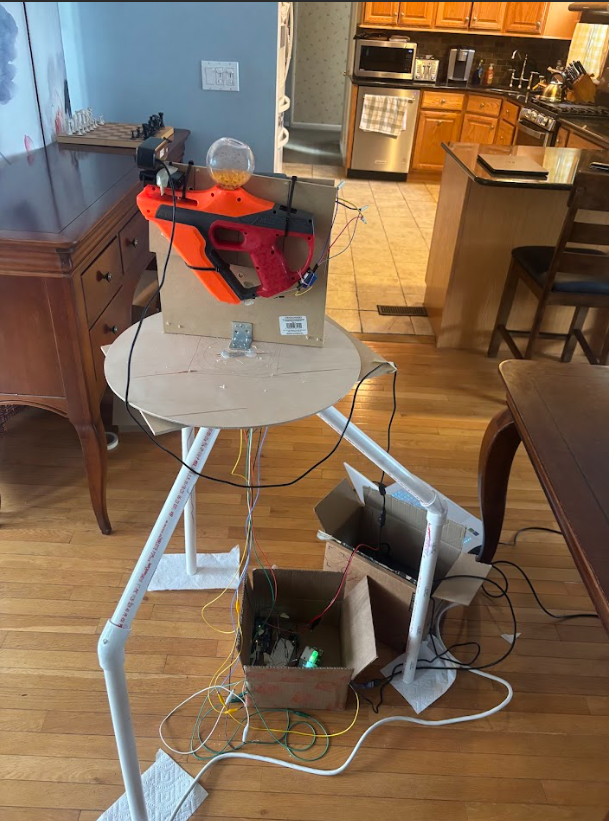
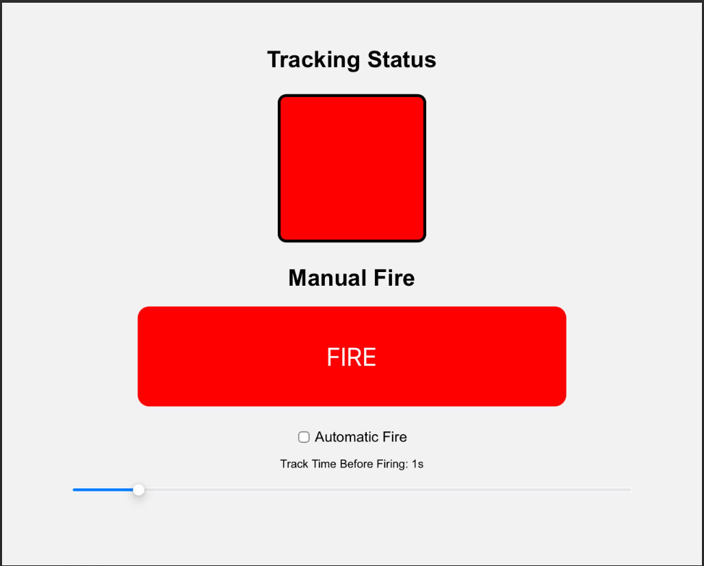
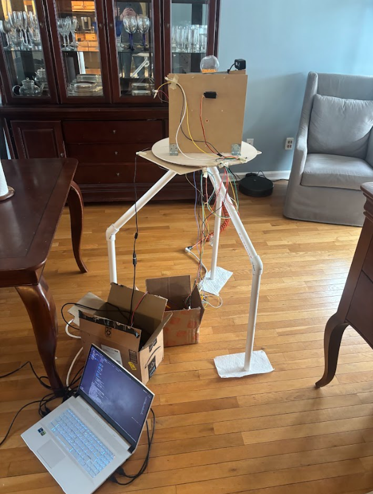
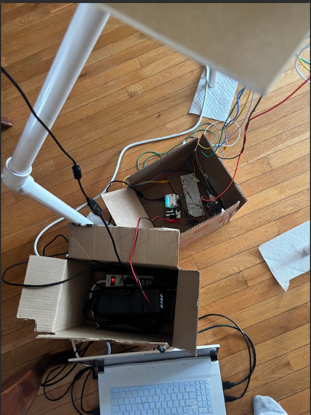

# 🎯🔫 Autonomous & Manual Nerf Turret

A modular pan–tilt turret supporting computer vision tracking, manual control, and web based firing control.

Watch the Youtube video [here](https://www.youtube.com/@giraffelabs)!

Built with Python, OpenCV, Pygame, [Ultralytics YOLOv8](https://github.com/ultralytics/ultralytics), Flask, Cloudflare, and Arduino

## ℹ️ Overview

This is actually not my first time making this project. I built a 1.0 version last year, however I knew I could improve it significantly. This is my improved 2.0 version and I am very proud of it. It combines mechanical, electrical, and computer engineering into one giant project. Ever since I was a young child, I loved Nerf guns, and so this project is an expression of that.

## ⭐ Features

* **Autonomous Target Tracking** 🤖
    - Uses YOLOv8 nano for efficent human detection and tracking
    - Can handle multiple targets
    - Nonlinear pan/tilt acceleration for smoother tracking
* **Manual Control** 🎮
    - Full interfaces with Xbox controller using Pygame
    - Speed selector
    - Nonlinear joystick response with deadzones
* **Web Based Fire Control** 🌐
    - Uses Flask and Cloudflare to host a control app anywhere on the web
    - Live tracking status indicator
    - Manual fire control
    - Automatic fire control after a preset delay
* **Hardware Interface** ⚙️
    - Uses asynchronus serial to communicate between the laptop and Arduino
    - Seperate bench power supply for servos
* **Modular Design** 🧩
    - Each subsystem is distinct and can run independently
    - The circuit is directly wired into the Nerf gun's circuitry, so no need for any kind of solenoids

## 🔍 Technical Details
**Control Flow**

**Autonomous Vision** 🤖

For the autonomous mode, we use Ultralytics's [YOLOv8 Nano](https://github.com/ultralytics/ultralytics) model with persistant tracking. Since the camera is mounted on the moving gun, all we have to do is center the camera on the screen and it will be aiming correctly. At first, I used linear acceleration with no smoothing to control the servos. However, when I tested it, it was very jittery and would not stay on target long. To remedy this, I implemented a curve based acceleration model, meaning if the target is farther away, the servos will move faster, and slower when closer. This worked well and I managed fairly smooth tracking. Unfortunately, the tradeoff for speed is accuracy, and so it is still a bit jittery, but very fast. The program also outputs a binary tracking signal to the Raspberry Pi so that it can display the status on the app. If the turret has no target for a certain time (3 seconds but can be changed), it will automatically recenter itself so that way it will never get soft locked. This mode has no innate way of firing, unlike the manual control mode because you should be firing from the app.

**Manual Control** 🎮

If you don't want the AI to control the aim, you can instead! This program uses an identical serial interface to the autonomous mode, however instead of using a tracking loop, it reads in commands from a connected Xbox controller and applies a curve to them. This mode does not interface with the app, instead mapping the right trigger to fire. I also coded in a hotkey (the A button) to recenter the turret and the D pad to control speed using 3 presets (slow, medium, fast). These presets can be coded with any value from 0-270 deg/s however I chose 45, 90, and 180 for slow, medium, and fast respectively.

**Web Control** 🌐

For the autonomous mode, the operator needs a way to fire. In order to accomplish this, I set up a webserver using Flask and Cloudflare on my Raspberry Pi 4 and wired it directly into the Arduino. For safety reasons, I did not want to give the AI program direct access to firing (bad idea lol). The app has a few features, the most prominent of which being the status indicator and the fire button. The status indicator is normally red and when the turret picks up a target, it will turn green. The fire button rather obviously fires the turret. Then, the checkbox and slider below that are for automatic mode. When it is selected, a positive tracking signal will start an internal timer. If the target is mantained that entire time without losing it, a fire signal will be sent until the target is lost. The slider controls the aforementioned delay time. Also note that when automatic mode is selected, the indicator color is a bit different. Red is still the default, followed by yellow when a target is acquired, and green when firing begins.

**Hardware Interface & Control Electronics** ⚡

All commands from the Raspberry Pi and Laptop all run through the Arduino. The Arduino simply parses the serial and binary commands and converts that into tracking signal, firing signal, and servo positions. I am currently running it on 115200 baud async serial.

### ✍️ Author

My name is [Alexander Wiegand](https://github.com/alexw1230) and I am a sophomore Computer Engineering and AMS student at Stony Brook Honors College. My interests include machine learning, finance, robotics, mathematics, and more.

I also run the Youtube channel [GiraffeLabs](https://www.youtube.com/@giraffelabs)!